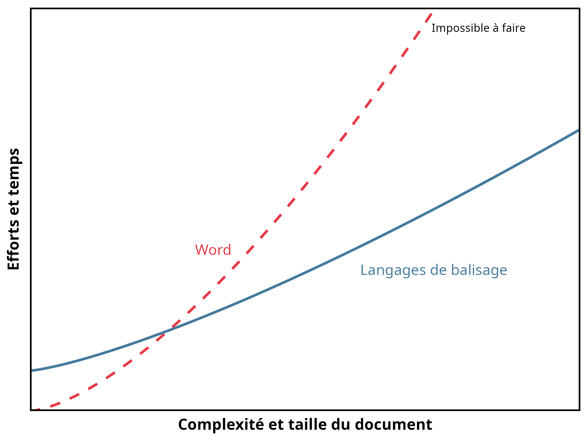
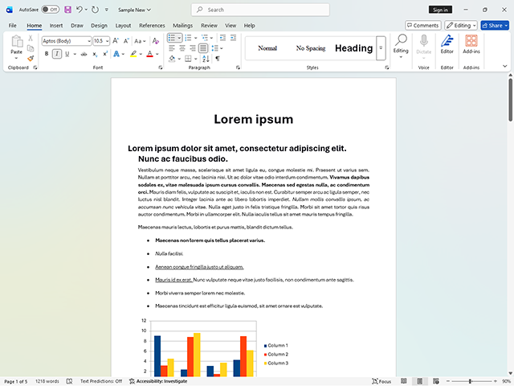
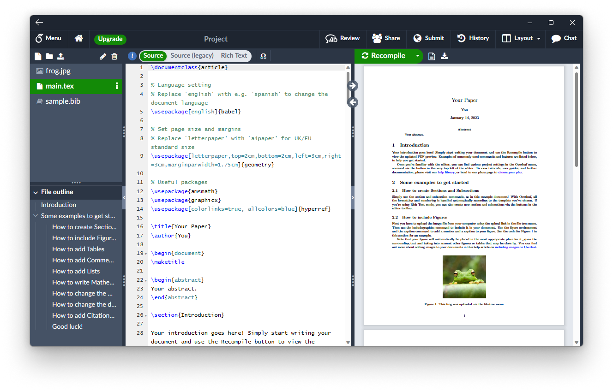

## Je me présente {.profile-slide}

### Marc-Antoine Dupuis

**Étudiant à la maîtrise en science politique, Université Laval**

- Projet de maîtrise sur les politiques publiques québécoises et canadiennes
- Assistant de recherche au CAPP et à Vox Pop Lab
- Projets : Datagotchi, Polimètre, Boussole Électorale
- Réserviste, Forces armées canadiennes

## Une clinique, pas un cours magistral {.source-slide background-color="#2c2218"}

Vous avez déjà eu beaucoup de théorie en avant-midi et vous en aurez encore en après-midi.

**Ici, l'objectif est différent : repartir avec des gestes concrets.**

Un minimum de théorie pour comprendre le principe, puis du temps pour manipuler
vous-mêmes les outils.

## Ordre du jour

| Heure | Activité |
|---|---|
| **13:05–13:10** | Présentation et tour de classe |
| **13:10–13:20** | Théorie : le strict nécessaire |
| **13:20–13:50** | Pratique : manipuler les outils |
| **13:50–14:00** | Questions et retour à vos classes |

## Tour de classe

### Quelles sont vos connaissances?

- Avez-vous déjà utilisé **LaTeX** ou **Overleaf**?
- Avez-vous déjà utilisé **Markdown** ou **Quarto**?
- Utilisez-vous déjà **Zotero** pour vos références?
- Utilisez-vous déjà **Git** ou **GitHub**?
- Avez-vous déjà eu besoin d'un **gabarit institutionnel** (mémoire, thèse, article)?

On ajuste le rythme de la clinique selon vos réponses.

## 1 · Théorie : pourquoi? {.section-slide background-color="#2c2218"}

### Le strict nécessaire avant de passer à la pratique

## Comment choisir le bon outil?

Une grille simple, empruntée au chapitre 8 du *Livre d'outils* :

1. **Accessibilité** : peut-on réellement y avoir accès?
2. **Communauté** : trouvera-t-on de l'aide?
3. **Popularité dans le champ** : nos partenaires l'utilisent-ils?
4. **Compatibilité** : s'intègre-t-il à notre flux de travail?
5. **Transparence et réplicabilité** : peut-on comprendre et refaire?
6. **Adaptabilité et flexibilité** : l'apprentissage restera-t-il utile?

Aucun outil ne gagne sur tous les critères à la fois : le bon choix dépend du document à
produire.

## Exemple : Word vs LaTeX {.visual-slide}

{fig-alt="Utilité relative de Word et des langages de balisage" width="72%"}

**Word** : interface avec boutons, résultat visible immédiatement, fonctions limitées aux
boutons disponibles.

**LaTeX** : commandes écrites manuellement, contrôle presque illimité, coût d'apprentissage
plus élevé.

## Deux interfaces, un même résultat {.visual-slide}

::: {.columns}
::: {.column width="50%"}
{fig-alt="Interface de Microsoft Word"}

Résultat visible immédiatement, dans l'interface.
:::
::: {.column width="50%"}
{fig-alt="Interface d'Overleaf avec source LaTeX et PDF compilé"}

Source et résultat compilé, côte à côte.
:::
:::

## Qu'est-ce qu'une balise?

Un langage de balisage est un ensemble de **commandes entremêlées au texte**.

```markdown
Un résultat **important** et une nuance *utile*.
```

Quand vous cliquez sur **Gras** dans Word, le logiciel enregistre exactement la même
instruction — l'interface vous la cache simplement.

Le balisage rend l'instruction visible et redonne du contrôle à l'utilisateur.

## Structure d'un fichier `.tex` ou `.md`

**Même principe dans les deux cas :**

| Étape | `.tex` | `.md` / `.qmd` |
|---|---|---|
| **Prélude** — *quoi faire* | `\documentclass{}`<br>`\usepackage{...}` | En-tête YAML `---`<br>format, packages, bibliographie |
| **Contenu brut** | Texte + balises entre<br>`\begin{document}` … `\end{document}` | Texte + balises Markdown |
| **Compilation** | `pdflatex` / `xelatex` → PDF | `quarto render` → HTML, PDF, DOCX |

Une fois ce principe reconnu, apprendre un deuxième langage de balisage devient beaucoup
plus rapide.

## 2 · Pratique {.section-slide background-color="#2c2218"}

### Manipuler les outils, un exemple à la fois

## Gabarit LaTeX de l'Université Laval

La Faculté des études supérieures et postdoctorales (FESP) impose une mise en page précise
pour les mémoires et les thèses.

**<https://www.overleaf.com/latex/templates/tagged/ulaval>**

- des gabarits officiels existent pour respecter ces normes sans les recréer soi-même;
- **Overleaf** permet de les utiliser sans rien installer : importer le gabarit, éditer dans
  le navigateur, compiler en un clic.

On l'ouvre ensemble dans Overleaf.

## Gabarit `clessn/gabarit-fesp-ulaval`

Une version maintenue par le CLESSN, prête à l'emploi :

**<https://github.com/clessn/gabarit-fesp-ulaval>**

- structure déjà conforme aux exigences de la FESP;
- fichiers organisés par chapitre;
- il suffit de cloner le dépôt et de remplacer le contenu.

On regarde ensemble la structure du dépôt.

## Comment le gabarit s'assemble

Deux mécanismes distincts, à ne pas confondre :

| Fichiers | Rôle | Assemblés par |
|---|---|---|
| `00-resume.Rmd`<br>`00-abstract.Rmd`<br>`00--remerciements.Rmd`<br>`00-avant-propos.Rmd` | Pages préliminaires obligatoires (FESP) | Lus ligne par ligne et injectés dans le YAML de `index.Rmd` |
| `01-article1.Rmd`<br>`02-article2.Rmd`<br>`03-conclusion.Rmd`<br>`99-references.Rmd` | Chapitres du corps du texte | Listés dans `_bookdown.yml` (`rmd_files`) |

**`index.Rmd` est le fichier qu'on ouvre et qu'on knitte — mais c'est `_bookdown.yml` qui
décide de l'ordre des chapitres.**

## Le clic « Knit »

```text
index.Rmd + chapitres (voir _bookdown.yml)  -->  .tex  -->  PDF
```

- `bookdown` assemble les chapitres listés dans `_bookdown.yml`, dans l'ordre;
- le tout devient un seul `.tex` — Markdown ne sait pas composer une page (marges,
  bibliographie, table des matières), LaTeX le sait déjà;
- `xelatex` compile ce `.tex` en PDF final.

**Si un package LaTeX manque** (ex. `setspace.sty`), TinyTeX l'installe automatiquement au
premier essai — patientez, ça se règle tout seul.

## Zotero : exporter en BibTeX

Dans Zotero :

1. clic droit sur une référence (ou une collection);
2. **Exporter l'élément…**;
3. choisir le format **BibTeX**;
4. enregistrer ou glisser directement le résultat dans un fichier `.bib`.

```bibtex
@book{darwin03,
  author    = {Darwin, Charles},
  title     = {On the Origin of Species},
  publisher = {John Murray},
  year      = {1859}
}
```

Le fichier `.bib` peut ensuite être appelé depuis LaTeX ou Quarto.

## Compiler : exporter en PDF

**Dans RStudio**

- bouton **Render**, ou `quarto render presentation.qmd` dans le terminal.

**Dans Overleaf**

- bouton **Recompile**, en haut à droite de l'éditeur.

Dans les deux cas, le même principe s'applique : la source et ses balises sont transformées
en document final.

## Montrer : HTML — mon site web

**<https://github.com/MADUP212/MADUP212.github.io>**

- on ouvre `index.html` à côté du site publié;
- mêmes balises que dans Word ou LaTeX : titres, gras, listes, images;
- ici, la « compilation » se fait directement dans le navigateur.

## Montrer : cette présentation — Markdown

**<https://github.com/MADUP212/MADUP212.github.io/tree/main/presentation_eiom>**

- cette présentation est écrite en Markdown (Quarto `revealjs`);
- chaque diapositive commence par `##`, exactement comme un titre Word;
- on compare la source `.qmd` et le résultat affiché à l'écran.

## Ce que je retiens

- Une balise est une instruction que l'interface cache habituellement.
- Un fichier balisé suit toujours le même principe : prélude, contenu, compilation.
- Zotero, un gabarit institutionnel et RStudio/Overleaf suffisent pour démarrer.
- Le bon outil dépend du document à produire, pas d'une préférence absolue.

L'objectif n'était pas de tout mémoriser, mais de savoir **par où commencer**.

## Pour aller plus loin {.source-slide background-color="#2c2218"}

**Source principale**

*Outils de recherche en sciences sociales numériques*, « Livre d'outils ».

Chapitre 8, « Outils de rédaction en sciences sociales numériques : les langages de
balisage », Alexandre Fortier-Chouinard, Étienne Proulx et Maxime Blanchard.

Chapitre 1, « Le logiciel libre et le code source ouvert », Jozef Rivest et Catherine
Ouellet.

## Questions {.questions-slide background-color="#2c2218"}

### 13:50–14:00

**À 14:00 : retour à vos classes.**
